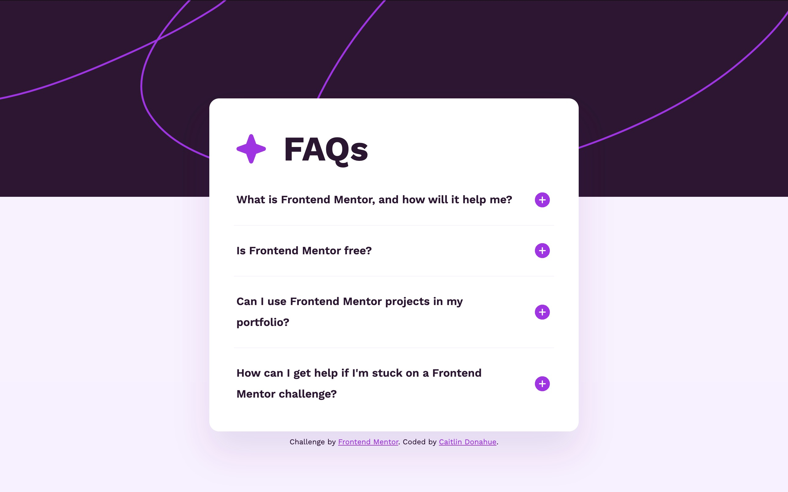

# Frontend Mentor - FAQ accordion solution

This is a solution to the [FAQ accordion challenge on Frontend Mentor](https://www.frontendmentor.io/challenges/faq-accordion-wyfFdeBwBz). Frontend Mentor challenges help you improve your coding skills by building realistic projects.

## Table of contents

- [Overview](#overview)
  - [The challenge](#the-challenge)
  - [Screenshot](#screenshot)
  - [Links](#links)
- [My process](#my-process)
  - [Built with](#built-with)
  - [What I learned](#what-i-learned)
  - [Useful resources](#useful-resources)

## Overview

### The challenge

Users should be able to:

- Hide/Show the answer to a question when the question is clicked
- Navigate the questions and hide/show answers using keyboard navigation alone
- View the optimal layout for the interface depending on their device's screen size
- See hover and focus states for all interactive elements on the page

### Screenshot

### Links

- Solution URL: [Github](https://github.com/Donahuec/frontend-mentor-faq-accordion)
- Live Site URL: [Github Pages](https://donahuec.github.io/frontend-mentor-faq-accordion/)

## My process

### Built with

- Semantic HTML5 markup -> details and summary components
- CSS custom properties
- WAAPI - Web Animation API

### What I learned

- Effectively use the details and summary html elements to create semantic html accordion, and the web animation api to animate it

### Useful resources

- [How to Animate the Details Element Using WAAPI](https://css-tricks.com/how-to-animate-the-details-element-using-waapi/) - Explained how to animate details components, allowing us to use the semantic html for our component, even though it does not natively support animations via css
